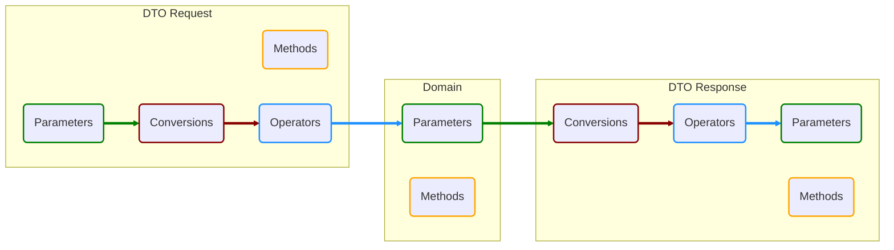

# Description

This project is a template project that implements a simple Hexagonal Architecture, with some facilitation packages and patterns.

This sample is targeted to Azure and Postgres, to adapt it to other clouds, you will need to change:
- **Configurations**: Any Azure related configuration will be market, so just delete them.
- **Session**: Project responsible to initiate the DBSession, any data base library that extends from this can be used, only changing the package and related objects.
- **Blob**: It's targeted for Azure Containers, change this project for other for any desired blob.

## Patterns

- **DDD** (Domain Driven Design): Really good pattern to decople integration logic from business logic.
  - Domain: Business objects that will be stored.
  - DTOs (Data Transfer Objects): objects responsible for the input / ouput of the application.
  
- **Middleware**: Intercept all the calls and standardize the outputs "CustomControllerBase", used by inheritance
- **Filters**: Intercept all the calls and log the executions, used by injetion
- **Unit of Work**: used to control the data base transactions easier, controlling the transaction workflows automatically.

## Packages

- **Swashbuckle**: Facilitates the Swagger generation for the API web interface.
- **RachTech.Logging**: It's a ILogger extesion library that facilitate the process of logging and tracking the application. [Rauchtech.Logging](https://github.com/eduardorauchbach/Rauchtech.Logging)
- **MethodBoundaryAspect.Fody**: Required to inject logs in any method that uses the [LogAspect] annotation from the RauchTech.Logging.
- **Dapper**: Makes the mapping from the data base easier and cleaner, as for the scripts executions and parameters.

## Security

- **Bearer Token**: One of the most common authentication methods, and it's used to validate the access to certain features and actions.
- **Password and Verification**: Encrypted to be saved and checked directly using the same encrypt key to check the results, not being logged anywhere.

<br/>
<br/>

# DDD



# **Configurations**

|Name|Value|
|--|--|
|APPLICATIONINSIGHTS_CONNECTION_STRING|Azure Application Insights conection string|
|ApplicationName|The name that will appear in the logs|
|LogLevel|Minimum log level to be logged, same as in the Microsoft.Logging library|
|LogFiltersBannedParameters|Properties that are not to be mapped in the Rauchtech.Logging filters|
|ConnectionString|Host=yourDB.sample;Port=5432;Username=??????;Password=???????;Database=????????|
|VerificationTimeout|Timeout for the verification to expire (in minutes)|
|VerificationMock|enables the mock of the verification, just for test purposes|
|BlobSettings||
|\| ConnectionString|Blob container connection string, can be found on the Azure Portal, container properties|
|\| BaseUrl|Blob base URL, to be used when building the files URLs to be presented as output|

``` json

"APPLICATIONINSIGHTS_CONNECTION_STRING": "",
"ApplicationName": "HexagonalAPI",
"LogFiltersBannedParameters": "Password",
"LogLevel": "Debug",

"ConnectionString": "",
"VerificationTimeout": 30,
"VerificationMock": true,

"BlobSettings": {
  "ConnectionString": "",
  "BaseUrl": "https://teste.blob.core.windows.net"
}
```